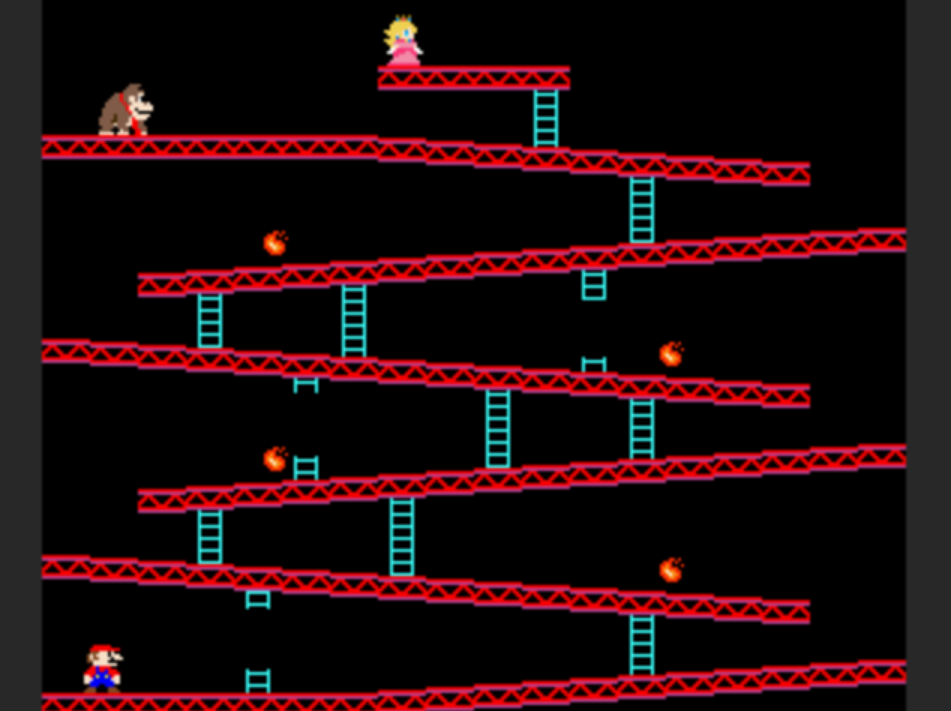
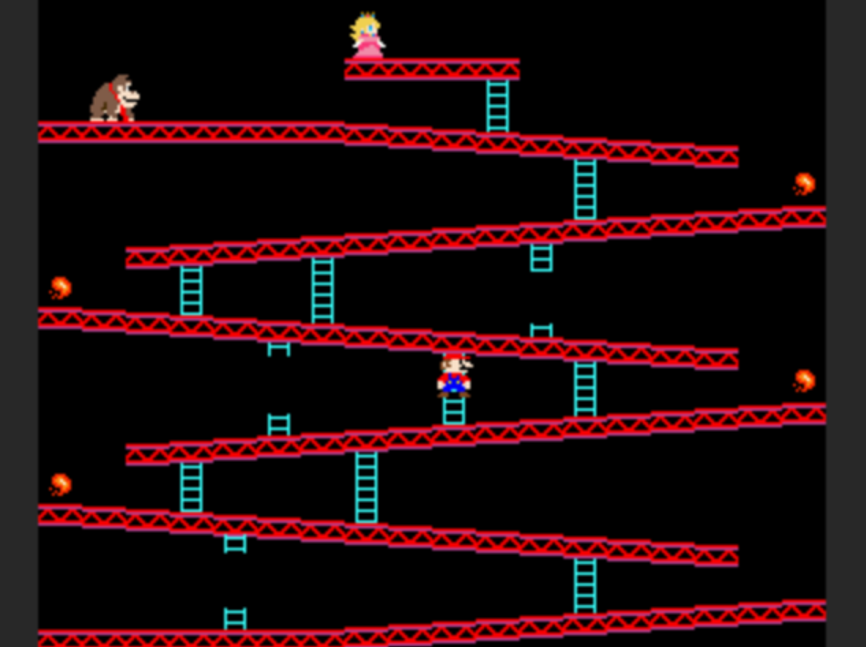
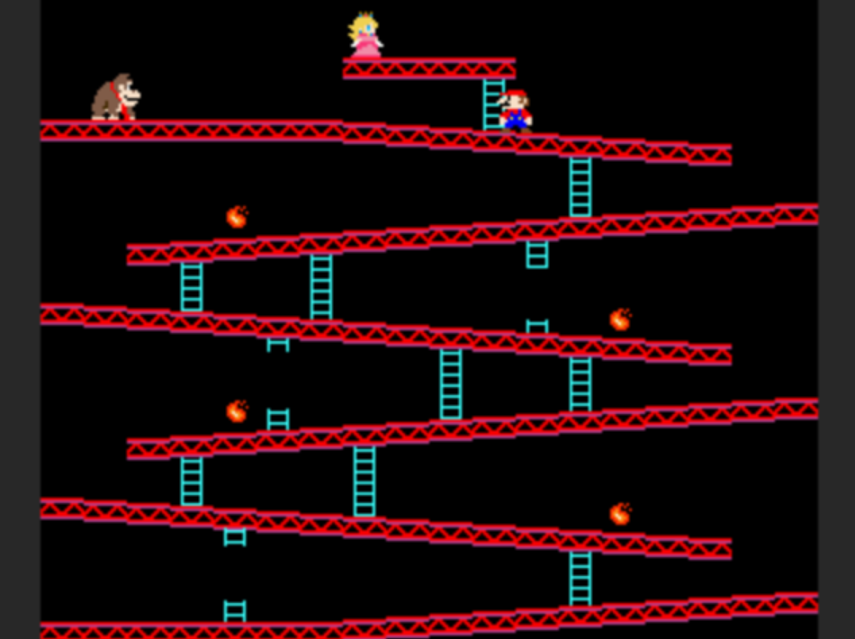
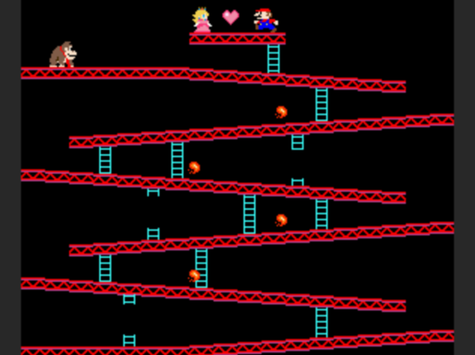

# Donkey Kong Game

This is a remake of the classic arcade game Donkey Kong, implemented in C. The game utilizes the CPUlator platform for emulating the CPU and running the game code. This game can also been ran on a DE1-SoC computer using a VGA and PS/2 keyboard.

## Features

- Recreation of the original Donkey Kong game.
- Implemented in C programming language.
- Utilizes CPUlator for CPU emulation.
- Includes animations and victory/losing screens.
- Supports keyboard controls.

## Usage
1. Download donkeykong.c to your computer
2. On CPUlator (linked in about section), select architecture as "ARMv7" and System as "ARMv7 DE1-SoC".
3. Select C as the language in the top menu, and add the donkeykong.c code to the program in the files tab.
4. Compile and load the program, and drag the VGA display and PS/2 keyboard devices so they are together on the "Devices" panel
5. Click continue to run the program.

## Controls
* Click text box labeled "type here" for user input with the PS/2 keyboard device.
* TAP left/right arrowkeys to control Marios movement.
* When near a ladder, TAP up/down arrowkeys to ascend the ladders.
* If you lose, or make it to the top, press ENTER to restart.
* Use precise timing to avoid all fireballs and reach the goal!

## Screenshots
| Using Ladders | 
|:-------------:|
||

| Near the Top | 
|:-------------:|
||

| Victory Animation | 
|:-------------:|
||

